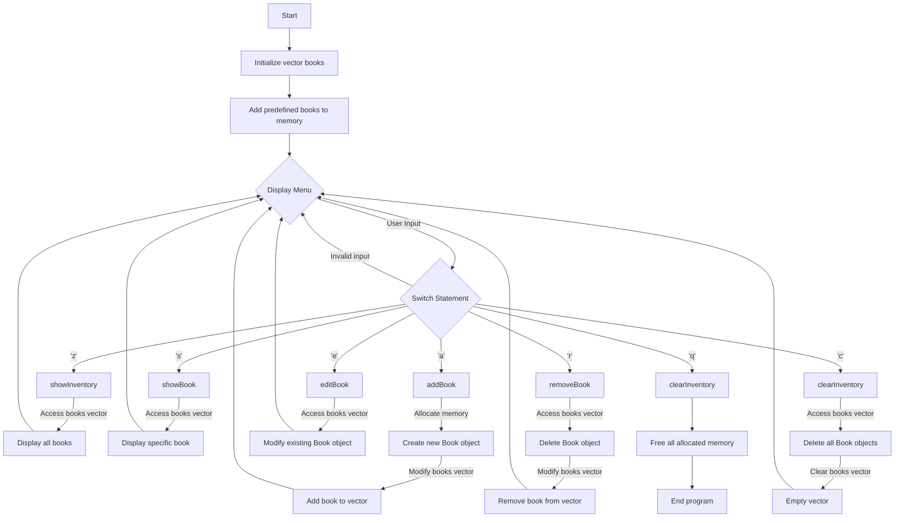

```mermaid
graph TD
    A[Start] --> B[Initialize vector<Book*> books]
    B --> C[Add predefined books to memory]
    C --> D{Display Menu}
    D --> |User Input| E{Switch Statement}
    
    E --> |'z'| F[showInventory]
    F --> |Access books vector| G[Display all books]
    G --> D
    
    E --> |'s'| H[showBook]
    H --> |Access books vector| I[Display specific book]
    I --> D
    
    E --> |'a'| J[addBook]
    J --> |Allocate memory| K[Create new Book object]
    K --> |Modify books vector| L[Add book to vector]
    L --> D
    
    E --> |'e'| M[editBook]
    M --> |Access books vector| N[Modify existing Book object]
    N --> D
    
    E --> |'r'| O[removeBook]
    O --> |Access books vector| P[Delete Book object]
    P --> |Modify books vector| Q[Remove book from vector]
    Q --> D
    
    E --> |'c'| R[clearInventory]
    R --> |Access books vector| S[Delete all Book objects]
    S --> |Clear books vector| T[Empty vector]
    T --> D
    
    E --> |'q'| U[clearInventory]
    U --> V[Free all allocated memory]
    V --> W[End program]
    
    E --> |Invalid input| D
```